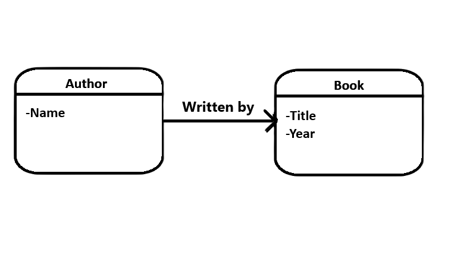
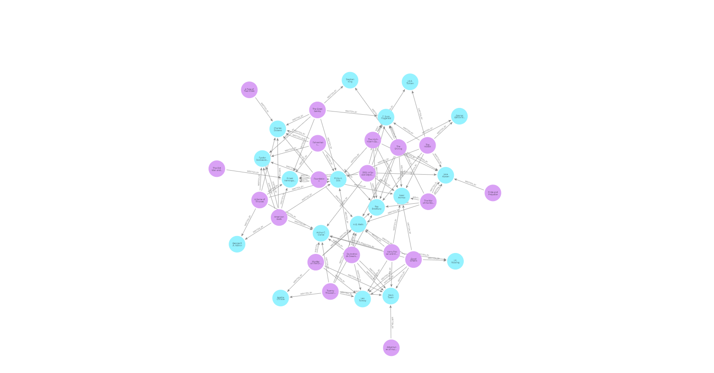

# Neo4j Book-Author Management App

## 1. Projekt koncepcji, założenia

### 1.1 Temat
Aplikacja do zarządzania książkami i autorami z wykorzystaniem bazy danych grafowej Neo4j. Umożliwia dodawanie autorów i książek, łączenie autorów z książkami, wyszukiwanie książek według autora oraz usuwanie autorów i książek.

### 1.2 Funkcjonalność
- Dodawanie autorów
- Dodawanie książek
- Łączenie autorów z książkami
- Wyszukiwanie książek według autora
- Usuwanie autorów
- Usuwanie książek
- Wyświetlanie wszystkich autorów
- Wyświetlanie wszystkich książek

## 2. Projekt bazy danych

### Diagram UML

### Wizualizacjia

Diagram przedstawia strukturę bazy danych grafowej Neo4j, w której węzły reprezentują autorów i książki, a krawędzie reprezentują relacje między nimi.

## 3. Opis wdrożenia

### 3.1 Implementacja
Aplikacja została zaimplementowana w języku Python z wykorzystaniem frameworka Flask. Do komunikacji z bazą danych Neo4j użyto biblioteki `neo4j`.

### 3.2 Architektura aplikacji
Aplikacja składa się z następujących plików:
- `app.py`: Główny plik aplikacji Flask, zawierający definicje tras i logikę aplikacji.
- `database.py`: Plik zawierający klasę `Database`, która obsługuje połączenie z bazą danych Neo4j i wykonuje operacje na bazie danych.
- `templates/index.html`: Plik HTML zawierający interfejs użytkownika z formularzami i przyciskami do wykonywania operacji na bazie danych.
- `static/css/style.css`: Plik CSS zawierający style dla interfejsu użytkownika.

### 3.3 Wykorzystane operacje bazy grafowej
- **Dodawanie autora**: `CREATE (a:Author {name: $name})`
- **Dodawanie książki**: `CREATE (b:Book {title: $title, year: $year})`
- **Łączenie autora z książką**: `MATCH (a:Author {name: $author}), (b:Book {title: $book}) CREATE (b)-[:WRITTEN_BY]->(a)`
- **Wyszukiwanie książek według autora**: `MATCH (a:Author {name: $author})<-[:WRITTEN_BY]-(b:Book) RETURN b.title AS title, b.year AS year`
- **Usuwanie autora**: `MATCH (a:Author {name: $name}) DETACH DELETE a`
- **Usuwanie książki**: `MATCH (b:Book {title: $title}) DETACH DELETE b`
- **Wyświetlanie wszystkich autorów**: `MATCH (a:Author) RETURN a.name AS name`
- **Wyświetlanie wszystkich książek**: `MATCH (b:Book) RETURN b.title AS title, b.year AS year`
- **Wyszukiwanie współautorów**: `MATCH (a:Author {name: $author})<-[:WRITTEN_BY]-(b:Book)-[:WRITTEN_BY]->(coauthor:Author) RETURN DISTINCT coauthor.name AS name`
- **Wyszukiwanie książek według wielu autorów**: `MATCH (b:Book)-[:WRITTEN_BY]->(a:Author) WHERE a.name IN $authors RETURN b.title AS title, b.year AS year, COLLECT(a.name) AS authors`
- **Znajdowanie najkrótszej ścieżki między autorami**: `MATCH path = shortestPath((a1:Author {name: $author1})-[:WRITTEN_BY*]-(a2:Author {name: $author2})) RETURN [n IN nodes(path) | n.name] AS path`
- **Wyszukiwanie autorów według książki**: `MATCH (b:Book {title: $title})-[:WRITTEN_BY]->(a:Author) RETURN a.name AS name`
- **Wyszukiwanie książek według zakresu lat**: `MATCH (b:Book) WHERE b.year >= $start_year AND b.year <= $end_year RETURN b.title AS title, b.year AS year`

## 4. Instrukcja uruchomienia

projekt jest dostepny pod adresem : `http://127.0.0.1:5000`.

## 5. Autorzy
- Wojciech Maciag